# JVM 探究
 * 请你谈谈你对JVM的理解？Java8虚拟机和之前的变化更新？
 * 什么是OOM，什么是栈溢出StackOverFlowError？怎么分析？
 * JVM的常用调优参数有哪些？
 * 内存快照如何抓取，怎么分析Dump文件？知道吗？
 * 谈谈JVN中，类加载器你的认识？

 Java虚拟机的原因：为了达到“所有硬件提供一致的虚拟平台”的目的，牺牲了一些硬件相关的性能特性。


# JVM由三个主要的子系统构成
 - 类加载器子系统
 - 运行时数据区（内存结构）
 - 执行引擎

# JVM整体架构
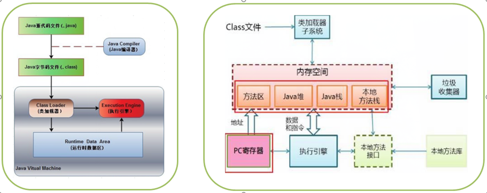

Java运行时编译源码(.java)成字节码，由jre(Java运行环境)运行。jre由java虚拟机（jvm）实现。Jvm分析字节码，后解释并执行。


 # 理论知识掌握
 1. JVM的位置

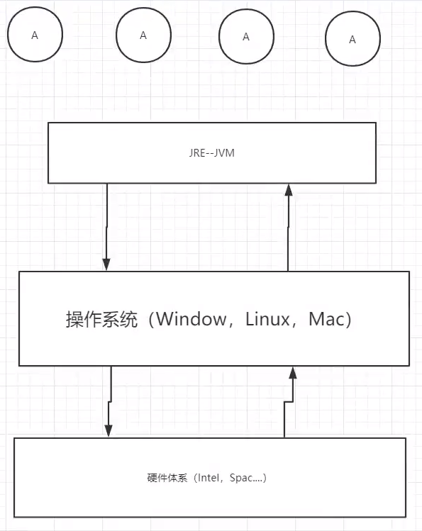
 <!--  -->

 2. JVM的体系结构

百度上的
 
<br/>
自己画的
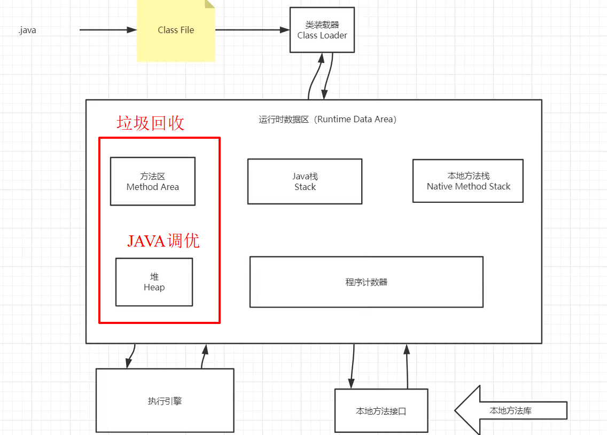
详细
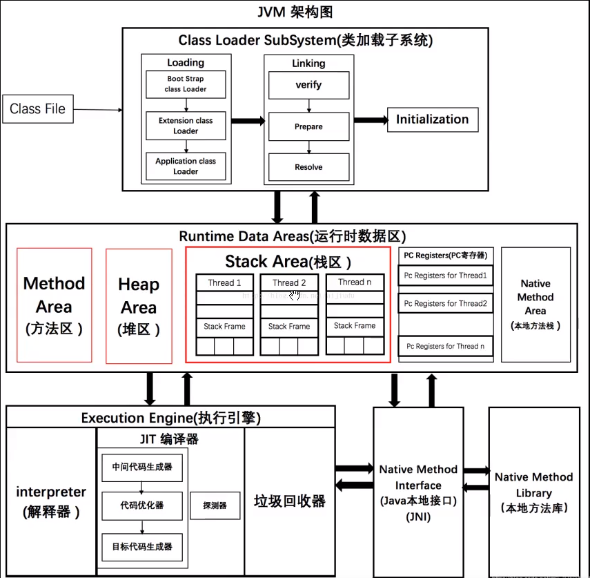

 3. 类加载器
<br/> 
    类是模板，对象是具体的。
    加载过程如图所示
    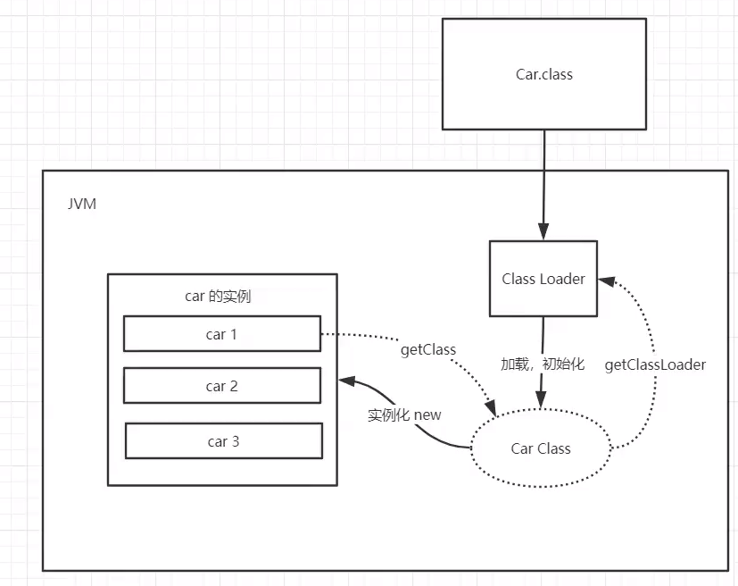
加载过程
```
1. 类加载器收到类加载的请求
2. 将这个请求向上委托给父类加载器去完成，一直向上委托，直到启动类加载器
3. 启动类加载器检查是否能够加载当前这个类，能加载就结束，使用当前的加载器，否则，抛出异常，通知子加载器进行加载
4. 重复步骤3
```
加载顺序：
虚拟器自带的加载器--》 启动类（根）加载器 --》 扩展类加载器--》 应用程序（系统类）
代码：
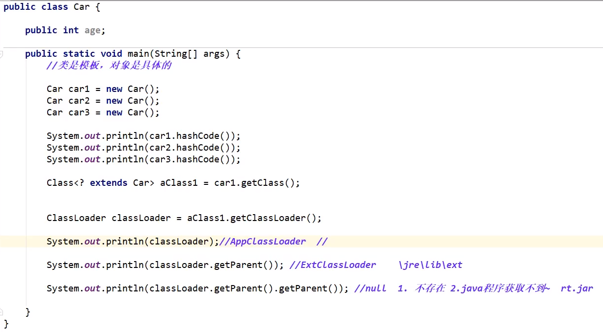

 4. 双亲委派机制
 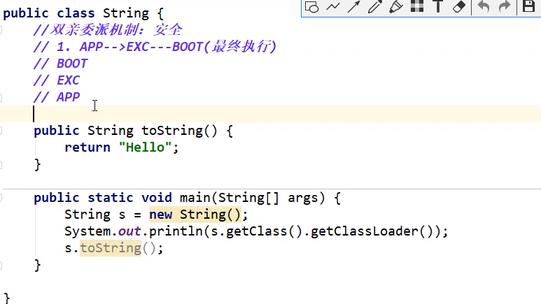

- JVM中提供了三层的ClassLoader：

 * 1. **启动类加载器（Bootstrap classLoader）**:主要负责加载核心的类库(java.lang.\*等)，构造\* ExtClassLoader和APPClassLoader。<br/>是用本地代码实现的类装入器，它负责将 <Java_Runtime_Home>/lib下面的类库加载到内存中（比如rt.jar）。由于引导类加载器涉及到虚拟机本地实现细节，开发者无法直接获取到启动类加载器的引用，所以不允许直接通过引用进行操作。

 * 2. **标准扩展类加载器（Extension ClassLoader)**：主要负责加载jre/lib/ext目录下的一些扩展的jar。<br/> 是由 Sun 的 ExtClassLoader（sun.misc.Launcher$ExtClassLoader）实现的。它负责将< Java_Runtime_Home >/lib/ext或者由系统变量 java.ext.dir指定位置中的类库加载到内存中。开发者可以直接使用标准扩展类加载器。

 * 3. AppClassLoader：主要负责加载应用程序的主函数类。<br/> 是由 Sun 的 AppClassLoader（sun.misc.Launcher$AppClassLoader）实现的。它负责将系统类路径（CLASSPATH）中指定的类库加载到内存中。开发者可以直接使用系统类加载器。

 双亲委派机制描述：
        
        某个特定的类加载器在接到加载类的请求时，首先将加载任务委托给父类加载器，依次递归，如果父类加载器可以完成类加载任务，就成功返回；只有父类加载器无法完成此加载任务时，才自己去加载。
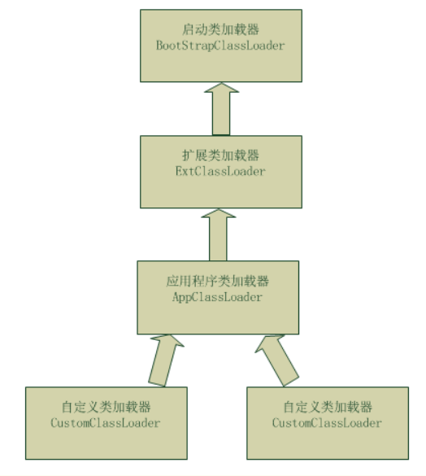
工作过程：

    1-类加载器收到类加载的请求；
    2-把这个请求委托给父加载器去完成，一直向上委托，直到启动类加载器；
    3-启动器加载器检查能不能加载（使用findClass()方法），能就加载（结束）；否则，抛出异常，通知子加载器进行加载。
    4-重复步骤三；

源代码如下：
```java
    public Class<?> loadClass(String name) throws ClassNotFoundException {
        return loadClass(name, false);
    }
    //              -----??-----
    protected Class<?> loadClass(String name, boolean resolve)
        throws ClassNotFoundException
    {
            // First, check if the class has already been loaded
            Class<?> c = findLoadedClass(name);
            if (c == null) {
                try {
                    if (parent != null) {
                        c = parent.loadClass(name, false);
                    } else {
                        c = findBootstrapClassOrNull(name);
                    }
                } catch (ClassNotFoundException e) {
                    // ClassNotFoundException thrown if class not found
                    // from the non-null parent class loader
                }
 
                if (c == null) {
                    // If still not found, then invoke findClass in order
                    // to find the class.
                    c = findClass(name);
                }
            }
            return c;
    }
```

> 几点思考:
>> 1. Java虚拟机的第一个类加载器是Bootstrap，这个加载器很特殊，它不是Java类，因此它不需要被别人加载，它嵌套在Java虚拟机内核里面，也就是JVM启动的时候Bootstrap就已经启动，它是用C++写的二进制代码（不是字节码），它可以去加载别的类。
>>> 这也是我们在测试时为什么发现System.class.getClassLoader()结果为null的原因，这并不表示System这个类没有类加载器，而是它的加载器比较特殊，是BootstrapClassLoader，由于它不是Java类，因此获得它的引用肯定返回null。

>> 2.  委托机制具体含义:
当Java虚拟机要加载一个类时，到底派出哪个类加载器去加载呢？
>>> * 首先当前线程的类加载器去加载线程中的第一个类（假设为类A）。
<br/>
注：当前线程的类加载器可以通过Thread类的getContextClassLoader()获得，也可以

>>> * 通过setContextClassLoader()自己设置类加载器。
如果类A中引用了类B，Java虚拟机将使用加载类A的类加载器去加载类B。

>>> * 还可以直接调用ClassLoader.loadClass()方法来指定某个类加载器去加载某个类。

>> 3. 委托机制的意义(安全) : 防止内存中出现多份同样的字节码
比如两个类A和类B都要加载System类：

>>> * 如果不用委托而是自己加载自己的，那么类A就会加载一份System字节码，然后类B又会加载一份System字节码，这样内存中就出现了两份System字节码。
>>> * 如果使用委托机制，会递归的向父类查找，也就是首选用Bootstrap尝试加载，如果找不到再向下。这里的System就能在Bootstrap中找到然后加载，如果此时类B也要加载System，也从Bootstrap开始，此时Bootstrap发现已经加载过了System那么直接返回内存中的System即可而不需要重新加载，这样内存中就只有一份System的字节码了。

## 面试题
### 能不能自己写个类叫java.lang.System？

    **答案**：通常不可以，但可以采取另类方法达到这个需求。

    **解释**：为了不让我们写System类，类加载采用委托机制，这样可以保证爸爸们优先，爸爸们能找到的类，儿子就没有机会加载。而System类是Bootstrap加载器加载的，就算自己重写，也总是使用Java系统提供的System，自己写的System类根本没有机会得到加载。

    但是，我们可以自己定义一个类加载器来达到这个目的，为了避免双亲委托机制，这个类加载器也必须是特殊的。由于系统自带的三个类加载器都加载特定目录下的类，如果我们自己的类加载器放在一个特殊的目录，那么系统的加载器就无法加载，也就是最终还是由我们自己的加载器加载。

 5. 沙箱安全机制


 6. Native
    
        native: 凡是带了native关键字的，说明java的左右范围达不到了，回去调用底层C语言的库！
        会进入本方法栈
        调用本地方法本地接口 JavaNativeInterface(JNI)
        JNI作用： 扩展JAVA的使用，融合不同的编程语言为Java所用！最初：C、C++.
        Jav诞生的时候，C、c++横行，想要立足，必须要有调用C、C++的程序
        它在内存区域中专门开辟了一块标记区域：Native Method Stack，登记nativ方法
        在最终执行的时候，加载本方法库中的方法通过JNI
        Java程序驱动打印机，管理系统，掌握即可，在企业级应用中较为少见！

        调用其他接口： Socket..WebService~.. http~

 7. PC寄存器


 8. 方法区(Method Area)

    方法区是被所有线程共享，所有字段和方法字节码，以及一些特殊方法，如构造函数，接口代码也在此定义，简单说，所有定义的方法的信息都保存在该区域，此区域属于共享区间；


 <table><tr><td bgcolor=#FF4500> 静态变量，常量，类信息(构造方法、接口定义)、运行时的常量池存在方法区中，但是实例变量存在堆内存中，和方法区无关 </td></tr></table>

简单说来<font color='red' size=4>`Static`，`final`,`Class`(模板),`常量池` </font> 

 <!-- <font color='red' size = 4> text </font> -->


 - 元数据区：元数据区取代了永久代(jdk1.8以前)，本质和永久代类似，都是对JVM规范中方法区的实现，区别在于元数据区并不在虚拟机中，而是使用本地物理内存，永久代在虚拟机中，永久代逻辑结构上属于堆，但是物理上不属于堆，堆大小=新生代+老年代。元数据区也有可能发生OutOfMemory异常。
        
        Jdk1.6及之前： 有永久代, 常量池在方法区
        Jdk1.7：       有永久代，但已经逐步“去永久代”，常量池在堆
        Jdk1.8及之后： 无永久代，常量池在元空间


 9. 栈

 栈：栈内存。主管程序的运行，生命周期和线程同步；
 线程结束，栈内存也就释放，对于栈来说<font color='red' size = 4> 不存在垃圾回收问题</font>。一旦线程救赎，栈就OVER!

 栈：8大基本类型+对象引用+实例的方法

 栈运行原理：栈帧

 栈满了：StackOverFlowError

    画出一个对象实例化的过程在内存中：

 10. 三种JVM

 * Sun公司 HotSpot `Java HotSpot(TM) 64-Bit Server VM 18.9 (build 11.0.5+10-LTS, mixed mode)`
 * BEA JRockit 运行最快的JVM
 * IBM J9 VM

 学习的是：HotSpot

 11. 堆

 Heap, 一个JVM只有一个堆内存，堆内存的大小是可以调节的。

 类加载器读取了类文件后，一般会把什么东西放到堆中？类，方法，常量，变量~，保存我们所有引用类型的真实对象。

 堆内存中还有细分为三个区域：

 * 新生区（伊甸园区） Young/New
 * 养老去 Old
 * 永久区（元空间） perm

 

垃圾回收主要是在伊甸园区（Eden Space)和养老区中进行的。
测试：
```
public class test {
    public static void main(String[] args) {
        String str = "jisdufnchai";
        while(true){
            str += str + new Random().nextInt(888888888) + new Random().nextInt(999999999);
        }
    }
}
```

测试结果：

 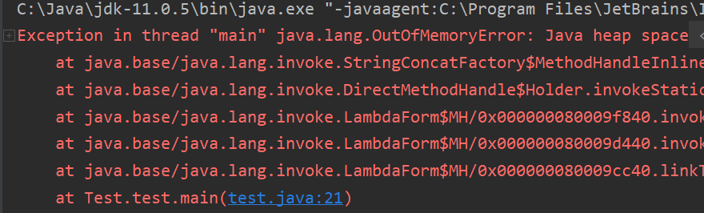

假设内存满了，OOM(OutOfMemoryError)，堆内存不够！
在JDK8以后，永久存储区改了一个名字（元空间）；

 12. 新生区、老年去

### 新生区
* 类：诞生和成长的敌方，甚至死亡；
* 伊甸园，所有的对象都是在伊甸园区new出来的！
* 幸存者区（1，0）

清理伊甸园区：轻量级GC; 清理老年区：重量级GC，full GC;

### 老年区
当用轻量级GC清理过以后，将幸存区里面的对象放到老年区。
老年区清理垃圾需要用到重量级GC

**真理**： 经过研究，99%的对象都是临时对象！

 13. 永久区


 这个区域常驻内存的。用来存放JDK自身携带的Class对象。Interface元数据，存储的是Java运行时的一些环境或类信息~，这个区域不存在垃圾回收！关闭VM虚拟就会释放这个区域的内存
 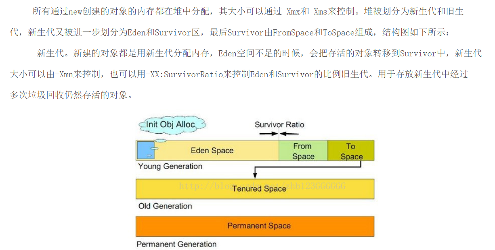

    新生代的GC：

        新生代通常存活时间较短，因此基于复制算法来进行回收，所谓复制算法就是扫描出存活的对象，并复制到一块新的完全未使用的空间中，对应于新生代，就是在Eden和其中一个Survivor，复制到另一个之间Survivor空间中，然后清理掉原来就是在Eden和其中一个Survivor中的对象。新生代采用空闲指针的方式来控制GC触发，指针保持最后一个分配的对象在新生代区间的位置，当有新的对象要分配内存时，用于检查空间是否足够，不够就触发GC。当连续分配对象时，对象会逐渐从eden到 survivor，最后到老年代。

        用javavisualVM来查看，能明显观察到新生代满了后，会把对象转移到旧生代，然后清空继续装载，当旧生代也满了后，就会报outofmemory的异常.

 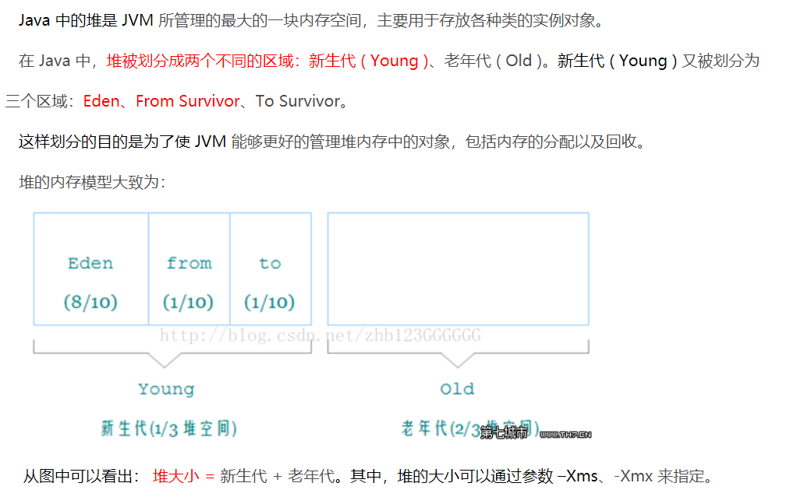
 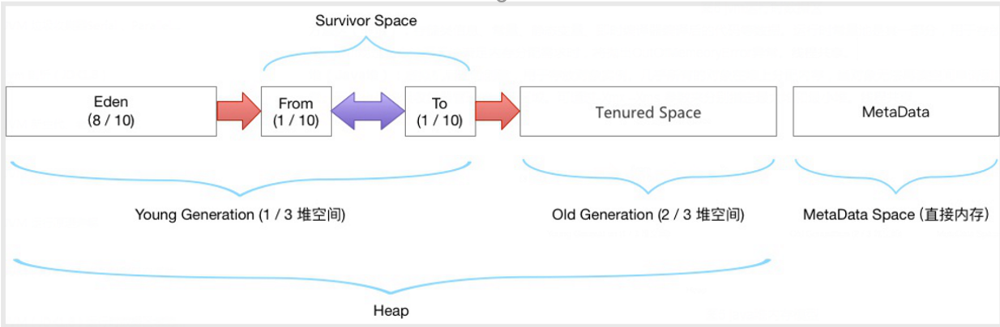
  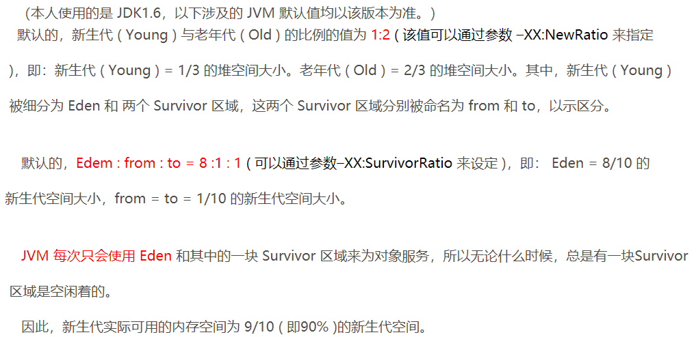
 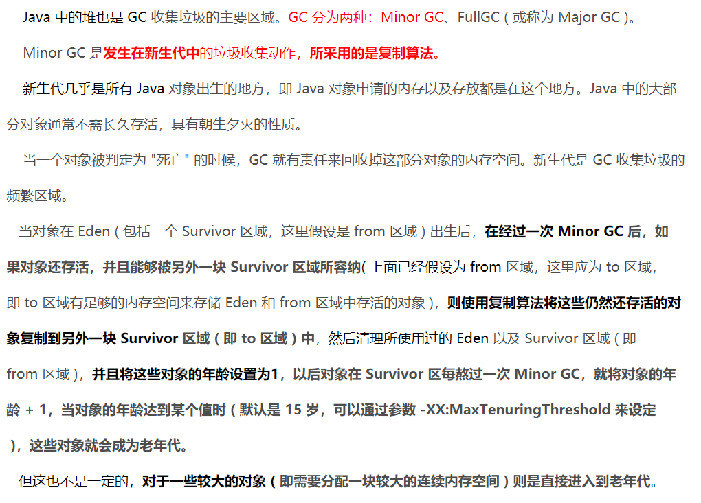

HotSpot虚拟机在1.8之后已经取消了永久代，改为元空间，类的元信息被存储在元空间中。元空间没有使用堆内存，而是与堆不相连的本地内存区域。所以，理论上系统可以使用的内存有多大，元空间就有多大，所以不会出现永久代存在时的内存溢出问题。这项改造也是有必要的，永久代的调优是很困难的，虽然可以设置永久代的大小，但是很难确定一个合适的大小，因为其中的影响因素很多，比如类数量的多少、常量数量的多少等。永久代中的元数据的位置也会随着一次full GC发生移动，比较消耗虚拟机性能。同时，HotSpot虚拟机的每种类型的垃圾回收器都需要特殊处理永久代中的元数据。将元数据从永久代剥离出来，不仅实现了对元空间的无缝管理，还可以简化Full GC以及对以后的并发隔离类元数据等方面进行优化。


 14. 对内存调优

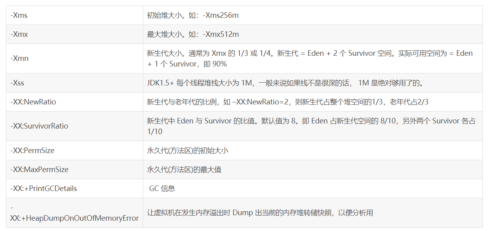

 15. DC
    <br/>(1) 常用算法
 16. JMM
 17. 总结

 在学习过程与遇到问题的解决方法：
 1. 百度
 2. 思维导图 

 [原出处](https://www.bilibili.com/video/av76728711?p=6)       
        