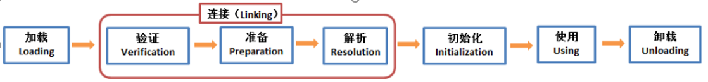
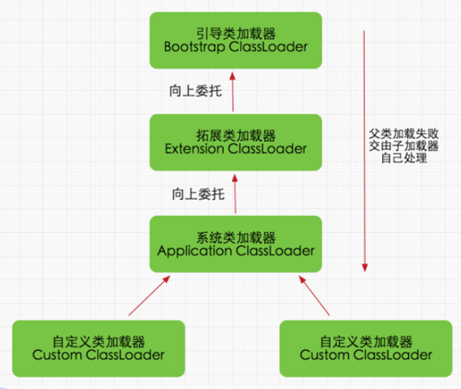
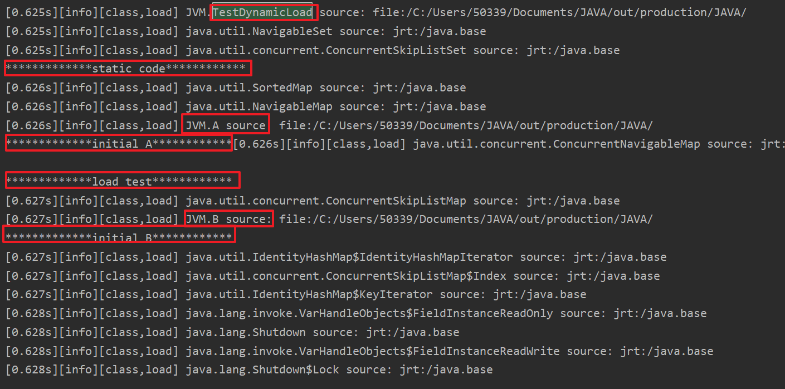
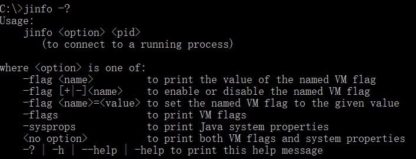
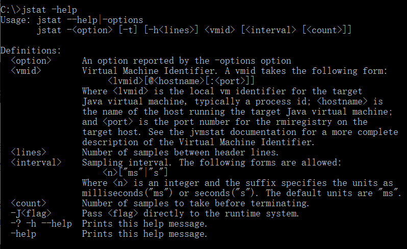
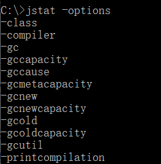
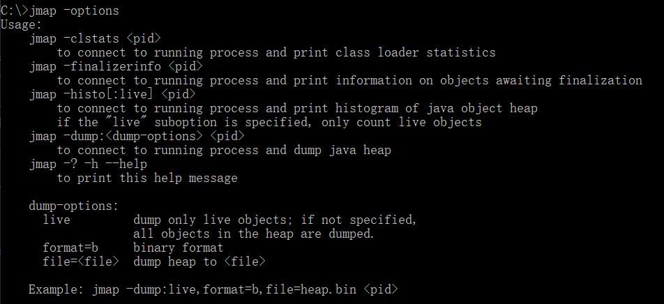
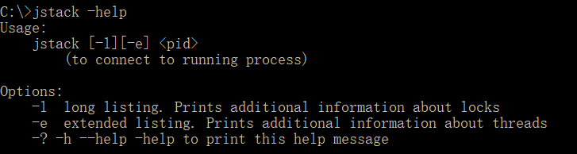

# 类加载过程



- 类加载：类加载器将class文件加载到虚拟机的内存
    - 加载：在硬盘上查找并通过IO读入字节码文件
    - 连接：执行校验、准备、解析（可选）步骤
    - 校验：校验字节码文件的正确性
    - 准备：给类的静态变量分配内存，并赋予默认值
    - 解析：类装载器装入类所引用的其他所有类
    - 初始化：对类的静态变量初始化为指定的值，执行静态代码块

## 加载器种类
- 启动类加载器：负责加载JRE的核心类库，如jre目标下的rt.jar,charsets.jar等
- 扩展类加载器：负责加载JRE扩展目录ext中JAR类包
- 系统类加载器：负责加载ClassPath路径下的类包
- 用户自定义加载器：负责加载用户自定义路径下的类包

**加载过程：**


### 加载机制

    - 全盘负责委托机制：当一个ClassLoader加载一个类时，除非显示的使用另一个ClassLoader，该类所依赖和引用的类也由这个ClassLoader载入
    - 双亲委派机制：指先委托父类加载器寻找目标类，在找不到的情况下在自己的路径中查找并载入目标类

- 双亲委派模式优势
    沙箱安全机制：自己写的String.class类不会被加载，这样便可以防止核心API库被随意篡改
    避免类的重复加载：当父亲已经加载了该类时，就没有必要子ClassLoader再加载一次

类加载过程：
```java
public class TestDynamicLoad {

    static {
        System.out.println("*************static code************");
    }

    public static void main(String[] args){
        new A();
        System.out.println("*************load test************");
        new B();
    }
}

class A{
    public A(){
        System.out.println("*************initial A************");
    }
}

class B{
    public B(){
        System.out.println("*************initial B************");
    }
}
```
vm参数：-verbose:class



用到什么类才会去加载。

## 调优命令
### jps
- jps 命令类似与 linux 的 ps 命令，但是它只列出系统中所有的 Java 应用程序。 通过 jps 命令可以方便地查看 Java 进程的启动类、传入参数和 Java 虚拟机参数等信息。
        
        参数说明
        -q：只输出进程 ID
        -m：输出传入 main 方法的参数
        -l：输出完全的包名，应用主类名，jar的完全路径名
        -v：输出jvm参数
        -V：输出通过flag文件传递到JVM中的参数

### jinfo
- jinfo 是 JDK 自带的命令，可以用来查看正在运行的 java 应用程序的扩展参数，包括Java System属性和JVM命令行参数；也可以动态的修改正在运行的 JVM 一些参数。当系统崩溃时，jinfo可以从core文件里面知道崩溃的Java应用程序的配置信息



    参数说明:
        pid 对应jvm的进程id

        executable core 产生core dump文件

        [server-id@]remote server IP or hostname 远程的ip或者hostname，
        server-id标记服务的唯一性id

    option:
        no option 输出全部的参数和系统属性

        -flag name 输出对应名称的参数

        -flag [+|-]name 开启或者关闭对应名称的参数

        -flag name=value 设定对应名称的参数

        -flags 输出全部的参数

        -sysprops 输出系统属性

### jstat
- Jstat是JDK自带的一个轻量级小工具。全称“Java Virtual Machine statistics monitoring tool”，它位于java的bin目录下，主要利用JVM内建的指令对Java应用程序的资源和性能进行实时的命令行的监控，包括了对Heap size和垃圾回收状况的监控。




`jstat --help|-options`

`jstat -<option> [-t] [-h<lines>] <vmid> [<interval> [<count>]]`

option： 参数选项
> -t： 可以在打印的列加上Timestamp列，用于显示系统运行的时间

> -h： 可以在周期性数据数据的时候，可以在指定输出多少行以后输出一次表头

> vmid： Virtual Machine ID（ 进程的 pid）

> interval： 执行每次的间隔时间，单位为毫秒

> count： 用于指定输出多少次记录，缺省则会一直打印

        option 可以从下面参数中选择
        -class 显示ClassLoad的相关信息；
        -compiler 显示JIT编译的相关信息；
        -gc 显示和gc相关的堆信息；
        -gccapacity 　　 显示各个代的容量以及使用情况；
        -gcmetacapacity 显示metaspace的大小
        -gcnew 显示新生代信息；
        -gcnewcapacity 显示新生代大小和使用情况；
        -gcold 显示老年代和永久代的信息；
        -gcoldcapacity 显示老年代的大小；
        -gcutil　　 显示垃圾收集信息；
        -gccause 显示垃圾回收的相关信息（通-gcutil）,同时显示最后一次或当前正在发生的垃圾回收的诱因；
        -printcompilation 输出JIT编译的方法信息；


### jmap
- 命令jmap是一个多功能的命令。它可以生成 java 程序的 dump 文件， 也可以查看堆内对象示例的统计信息、查看 ClassLoader 的信息以及 finalizer 队列。



        参数：
        option： 选项参数。
        pid： 需要打印配置信息的进程ID。
        executable： 产生核心dump的Java可执行文件。
        core： 需要打印配置信息的核心文件。
        server-id 可选的唯一id，如果相同的远程主机上运行了多台调试服务器，用此选项参数标识服务器。
        remote server IP or hostname 远程调试服务器的IP地址或主机名。

        option:
        no option： 查看进程的内存映像信息,类似 Solaris pmap 命令。
        heap： 显示Java堆详细信息
        histo[:live]： 显示堆中对象的统计信息
        clstats：打印类加载器信息
        finalizerinfo： 显示在F-Queue队列等待Finalizer线程执行finalizer方法的对象
        dump:<dump-options>：生成堆转储快照
        F： 当-dump没有响应时，使用-dump或者-histo参数. 在这个模式下,live子参数无效.
        help：打印帮助信息
        J<flag>：指定传递给运行jmap的JVM的参数

### jstack
- jstack是jdk自带的线程堆栈分析工具，使用该命令可以查看或导出 Java 应用程序中线程堆栈信息。

Jstack 用法


        参数说明：
        -l 长列表. 打印关于锁的附加信息,例如属于java.util.concurrent 的 ownable synchronizers列表.

        -F 当’jstack [-l] pid’没有相应的时候强制打印栈信息

        -m 打印java和native c/c++框架的所有栈信息.

        -h | -help 打印帮助信息

        pid 需要被打印配置信息的java进程id,可以用jps查询.


