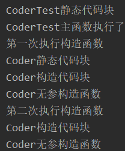

### 多态

* 父类引用调用子类方法

在设计良好的OOP程序中，大多数或者所有方法都会遵循tune()模型，而且只与基类接口通信。这样的程序是可扩展的，因为可以从通用的基类继承出新的数据类型，从而添加一些功能。

若父类中的方法是私有的，则不会被覆盖，也不会调用子类方法，则会调用父类中的私有方法，不会调用子类方法，不会产生多态行为。

在子类中，对于父类中的private方法，最好采用不同的名字。

* 域与静态方法（都不会产生多态行为）

任何域访问操作都将由编译器解析，因此不是多态。

静态方法是与类，而并非与单个的对象相关联的。

* 构造器

构造器不具有多态行为，他们实际上是static方法，只不过该static声明是隐式的。

初始化顺序：[参考](https://blog.csdn.net/Dcwjh/article/details/89049154)

先父类，后子类。

静态代码块 -》 非静态代码块(有对象创建的时候才会执行) -》构造器

```java
public class CoderTest {
    static{
        System.out.println("CoderTest静态代码块");
    }
    {
        System.out.println("CoderTest构造代码块");
    }

    CoderTest()
    {
        System.out.println("CoderTest无参构造函数");
    }

    public static void main(String[] args) {
        System.out.println("CoderTest主函数执行了");
        System.out.println("第一次执行构造函数");
        Coder c1 = new Coder();
        System.out.println("第二次执行构造函数");
        Coder c2 = new Coder();

    }
}


class Coder{
    static{
        System.out.println("Coder静态代码块");
    }
    {
        System.out.println("Coder构造代码块");
    }

    public Coder(){
        System.out.println("Coder无参构造函数");
    }
}
```


        顺序：
        主函数静态代码块
        主函数执行
        其他类的静态代码块（被调用，就加载该类，同时静态成员也属于该类（不属于对象），只加载一次）
        非静态代码块（创建对象时，目的：初始化成员数据，在构造器之前执行。 只要创建对象就会被执行）
        构造器


* 父类构造器总是在子类的构造过程中被调用，而且按照继承层次逐渐向上链接，以使每个父类的构造器都能得到调用。

原因如下：

因为构造器具有一项特殊任务：检查对象是否被正确的构造。子类只能访问他自己的成员，不能访问父类中的成员（父类成员中的数据成员通常是private类型)。 只有父类的构造器才具有恰当的知识和权限来对自己的元素进行初始化。因此必须令所有构造器都得到调用，否则就不可能正确构造完成对象。

* 动态绑定

概念：在运行时根据对象的类型进行绑定。

动态绑定是在运行时才决定的，因为对象无法知道它是属于方法所在的那个类，还是属于那个类的子类。

若方法出现在父类构造其中，且子类覆盖了该方法，就会导致动态绑定方法中的数据没有得到及时的初始化，而得到不想要的结果。（P164 Thinking in Java）

编写构造器的准则：用京可能简单的方法使对象进入正常状态；如果可以的话，避免调用其他方法。

在构造器内唯一能够安全调用的那些方法就是父类中的final方法（也适用于private方法，他们自动属于final方法）。这些方法不能覆盖就不会出现令人惊讶的问题。

### 继承

所有东西都可以被继承，因为多态是一中巧妙地工具。

我们在建立新类地时候，如果首先考虑继承技术，反倒会加重我们地设计负担，使事情变得不必要地复杂起来。

更好地设计方式是首先选择“组合”， 尤其是不能十分确定使用哪以中方式时。组合不会强制我们地程序设计进入继承的层次结构中，而且组合更加灵活。

用继承表达行为间的差异，并用字段表达着状态上的变化；运用组合使自己的状态发生变化


